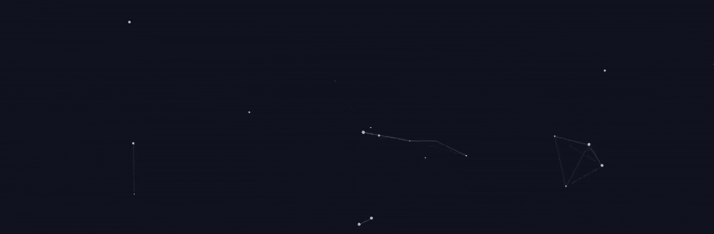

# 🐳 From Mer to Earth: Greetings, earthling!

I'm a computer science researcher specialising in LLM Interpretability and Cognitively-Inspired AI. I'm passionate about building models that are not only powerful but also logically understandable. Though I should add, I do tend to diverge and dabble in a quite a few more passion projects or fascinating algorithmic questions as well. :)

### Current Highlights of My Life

- 🔎 Finishing my Master's thesis on *generative model interpretability* (the repository is still private, whoops).
- 🧠 Leading the design of an extremely fun and challenging *educational C.S. game* for undergraduate students.
- 🔭 Exploring *concept-based interpretability* methods for RAG systems as a research mentor.
- 🤖 And of course, beginning my journey into *Neurosymbolic AI* for my future PhD.

## About Me

My core interest lies at the intersection of machine learning and human cognition; I've been diving deeply into both, and mean to merge conceptual models of the human cognition with the design of ML systems to improve how models *think* and hopefully perform. When I'm not working on research, I enjoy creative coding, developing tools for other developers (like VSCode themes), and applying mathematical concepts to practical programming challenges.

### 🛠️ My Tech Stack

<blockquote>
  

    
⠀AI & Machine Learning

    

      
      
      
      
      
      
      
    

  

  
  

    
⠀Other Languages & Databases

    

      
      
      
      
      
      
    

  

  
  

    
⠀Design & Illustration

    

      
      
      
      
      
      
    

  

  
  

    
⠀Tools & Platforms

    

      
      
      
      
    

  

</blockquote>

## My GitHub Stats

<!--

-->

  

---

## 📫 Get In Touch

I'm always excited to connect with fellow researchers, developers, and creative minds. Whether you have a question about my work, spot a fascinating problem, or just want to discuss the future of AI and cognition, please don't hesitate to reach out. You can find me here:

- **Portfolio:** [msmaryamrezaee.github.io](https://msmaryamrezaee.github.io)
- **Email:** [ms.maryamrezaee@gmail.com](mailto:ms.maryamrezaee@gmail.com)
- **Telegram:** [@msmrexe](https://t.me/msmrexe)

<!--
---

### 🌱 My Core Research Interests

* LLM Interpretability & Explainable AI (XAI)
* Cognitively-Inspired AI
* Neurosymbolic Architectures
* Human-Aligned Reasoning
* Symbolic Program Generation
* Robustness in Neural Models

---

### 🚀 What I'm Currently Working On

* My MSc thesis on [Briefly state your thesis topic]
* A project involving [Your project on program generation or another key project]
* Exploring [A new topic or tool you're learning, e.g., "JAX" or "Causal Inference"]

---

## Featured Projects

### 🔬 AI Research
- **[Concept-Based Interpretability for RAG](link-to-repo)**: My ongoing research on using concept vectors to understand what RAG models retrieve and generate.
- **[Master's Thesis: Interpretability in LLMs](link-to-repo-or-website)**: Investigating the internal mechanisms of output generation in large language models.
- **[ESCI: Energy-Based Concept Interpretation](link-to-repo)**: A framework for interpreting black-box LLM responses.

### 💻 University & Course Projects
- **[Image Colorization with VAEs](link-to-repo)**: A project from my M.S. Machine Learning course implementing a Variational Autoencoder for image colorization.
- **[PostgreSQL Database Project](link-to-repo)**: Designed and implemented a relational database for a mathematical databases course.
- **[RSA Encryption in Python](link-to-repo)**: A from-scratch implementation of the RSA encryption algorithm.

### 🎨 Creative & Passion Projects
- **[My-Cool-Theme for VSCode](link-to-repo-or-marketplace)**: A popular dark theme I developed for Visual Studio Code.

-->
